# 麻老板无人系统_JAVA服务端

### 本仓库是Java服务端独立部署的文件 是线上版本 可以正常使用
#### 配套小程序端已开源 仓库地址：
##### Bitbucket: https://bitbucket.org/scyanzu/24h_qipaishi
##### Github: https://github.com/q127981/24h_qipaishi.git
##### 配套的服务端：

百度网盘：https://pan.baidu.com/s/1k3xbcoSyZEJ4O62kHRyiDw?pwd=x1vi 提取码: x1vi

注意：本版本更新必须按照新部署教程，否则系统将无法使用！！！！
首次搭建视频教程：https://www.bilibili.com/video/BV1wgKaztEnD

## 项目说明
#### 开发语言为Java8 Spingboot框架，后台管理系统是vue开发，前后端分离。
#### 本项目为打包好的私有化部署版，不是源码，需要自行准备服务器，搭配我们开源的小程序系统使用，仅供个人学习与交流。
#### 项目没有设置任何过期时间，也没有任何后门木马程序，欢迎提交给安全机构检测
#### 需要服务的源码的客户请联系我们购买，提供无人自助系统全套源码（小程序端+Java服务端+后台管理系统端），售价10000元
#### 可签合同 可开发票 包实施 包更新

## 功能介绍
#### 本系统适用于无人值守场景（茶室、棋牌室、私人影院、台球室、KTV），主要功能流程为:顾客小程序下单预约—-自助开门—-开电—-云喇叭语音提醒。
#### 集成了门店管理、保洁、预约、优惠卡券、用户余额充值、团购下单等功能，具体可自行扫码体验。
#### 已对接好美团、大众点评、抖音、快手四大平台的团购核销功能
#### 适合做这个行业的公司，技术团队，或者准备开很多连锁店的客户。
#### 多门店、多租户，可以一套系统，搭建N个小程序，每个小程序创建N个门店。
#### 多套模板可选，可以自己在后台随意更换UI，也可以根据自己喜好设计模板进行替换。
#### 首页支持自定义UI，并可提供多款免费UI  也可以自己下载代码后进行二次开发

| biu                                                       | biu                                               | biu                                                        |
|-----------------------------------------------------------|---------------------------------------------------|------------------------------------------------------------|
| 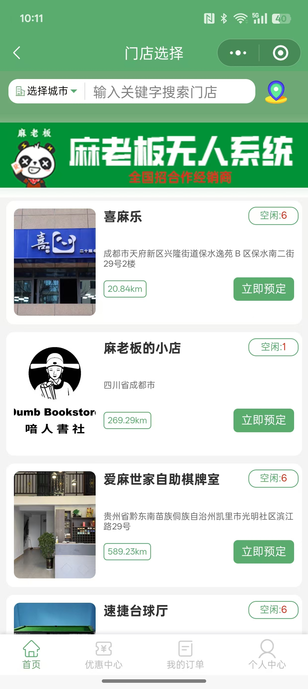 | | 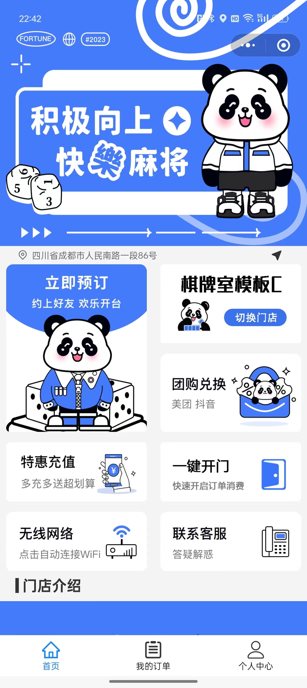| 
| 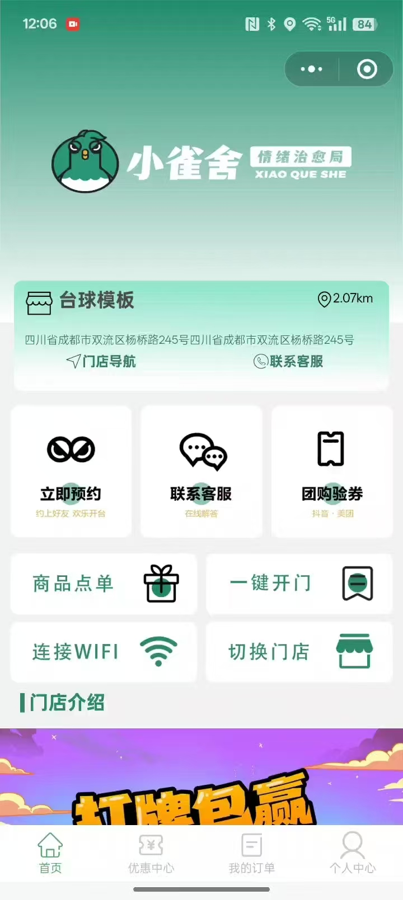  | | 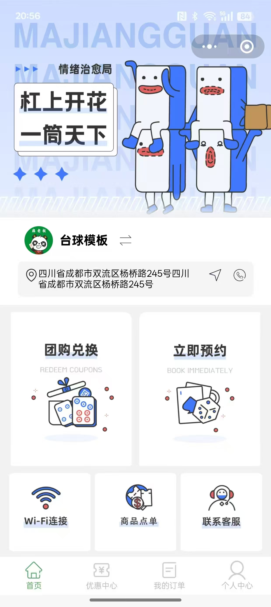| 
| 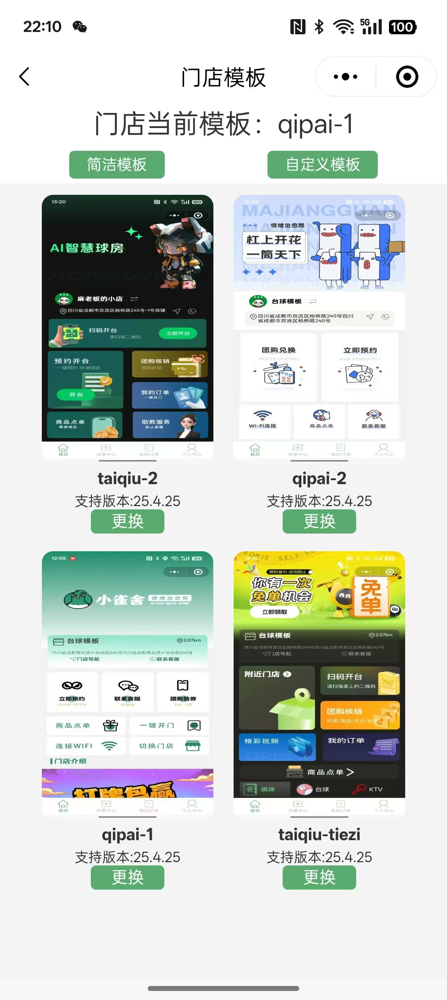 | 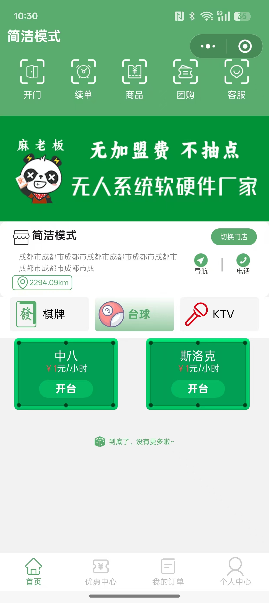| 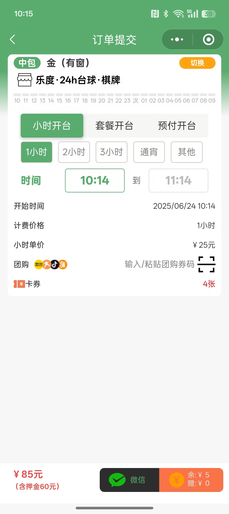| 
| 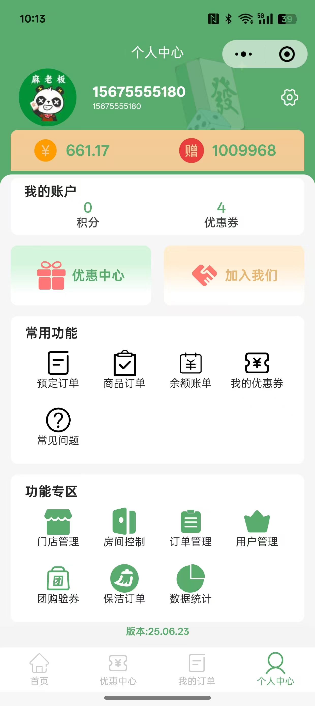 | 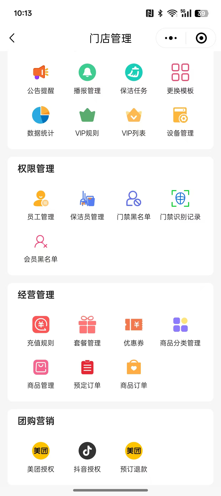| 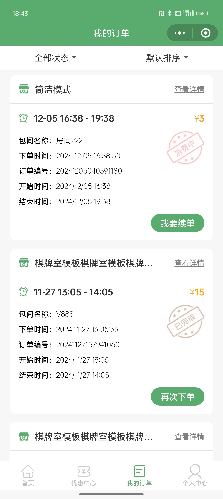| 
| 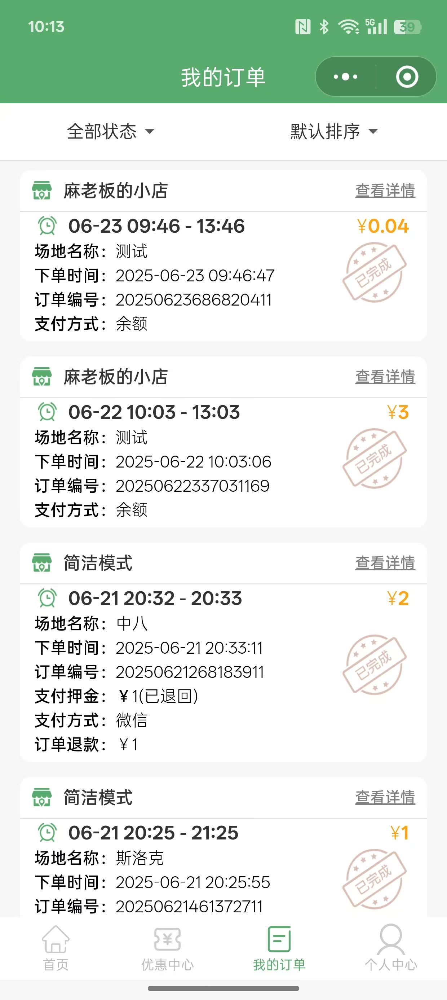 | 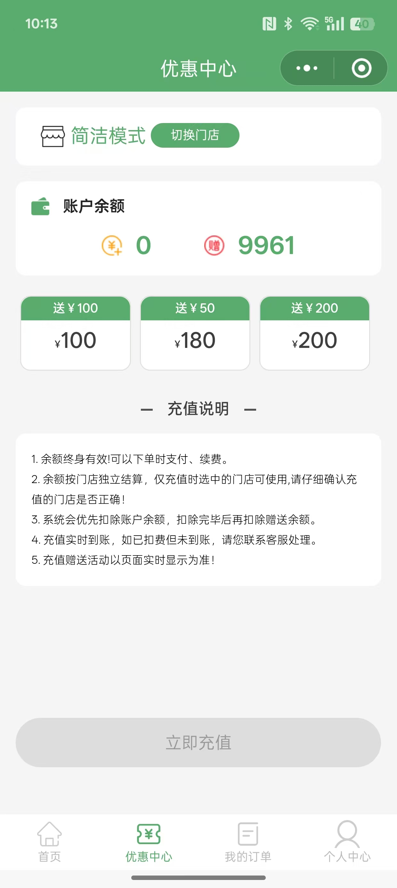| 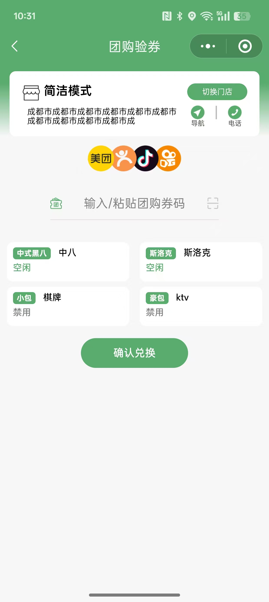| 
## 完整功能清单
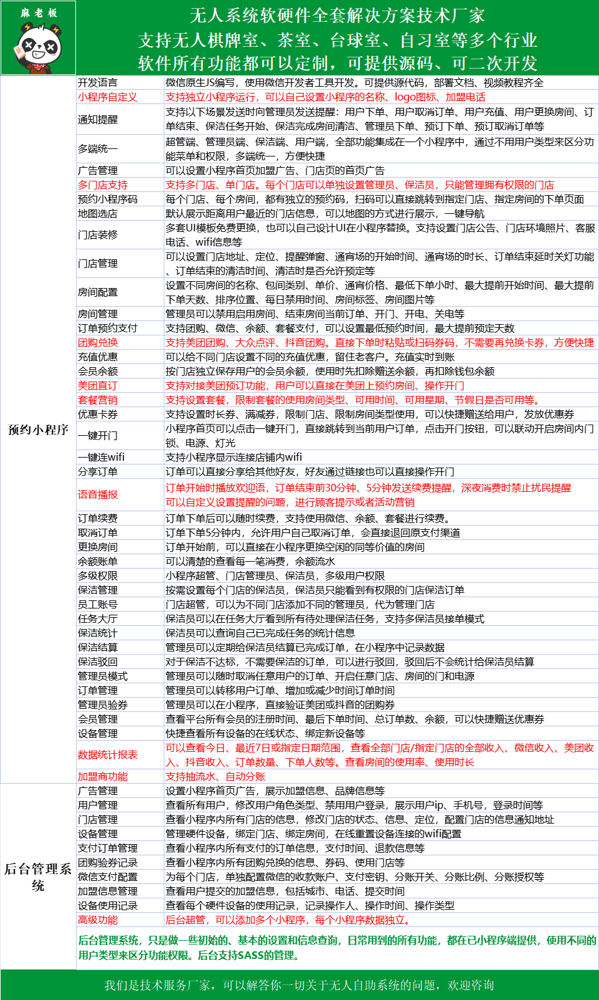

## 硬件设备说明
### 本系统已经对接好所需的各种硬件，从我们淘宝店硬件买回来，把编号添加进系统就能用。
### 硬件可提供API文档，支持二次开发，接入到自己的系统。 淘宝店铺：后羿物联

## 功能体验
| 联系我们                                               | 扫码体验小程序                                              |
|----------------------------------------------------|------------------------------------------------------|
|  |  |